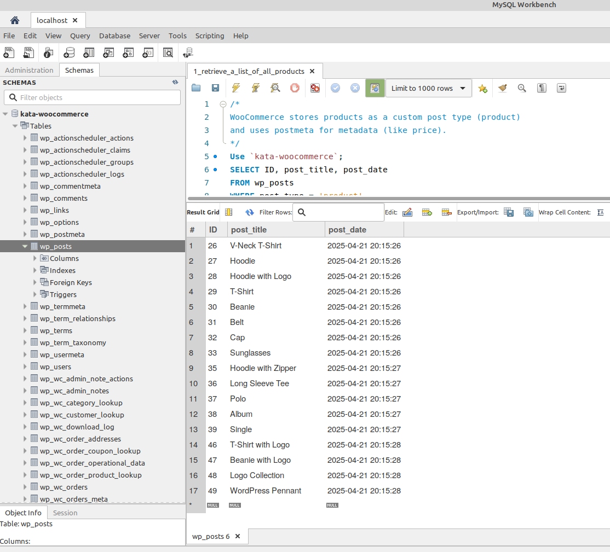
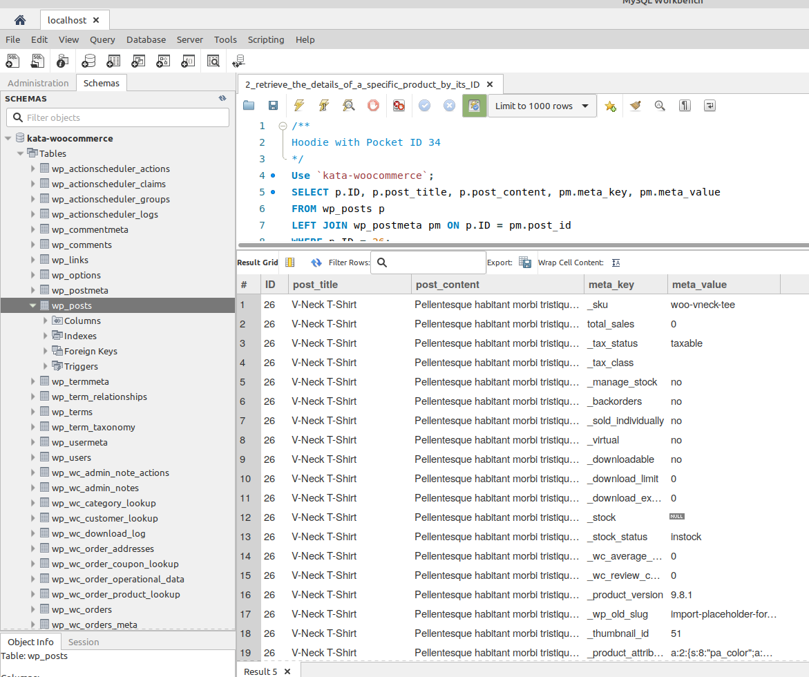
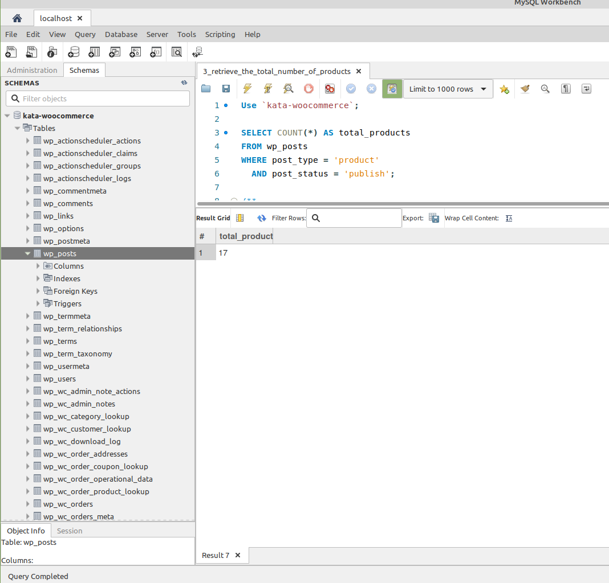
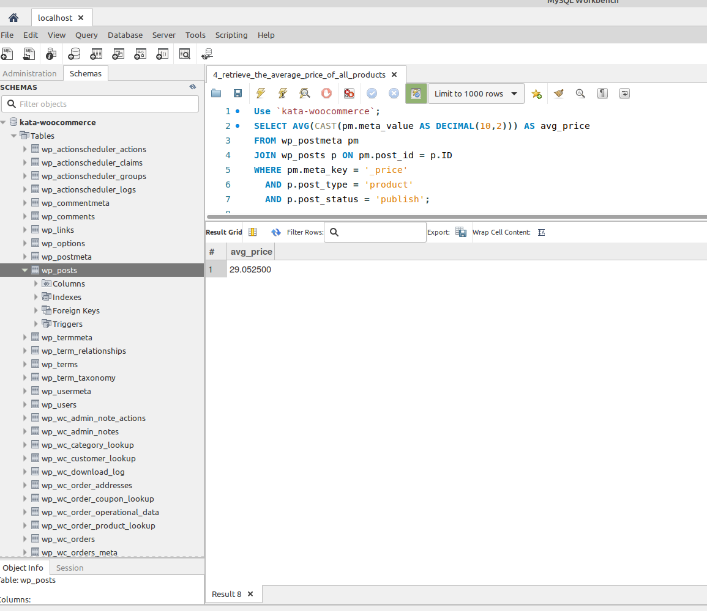
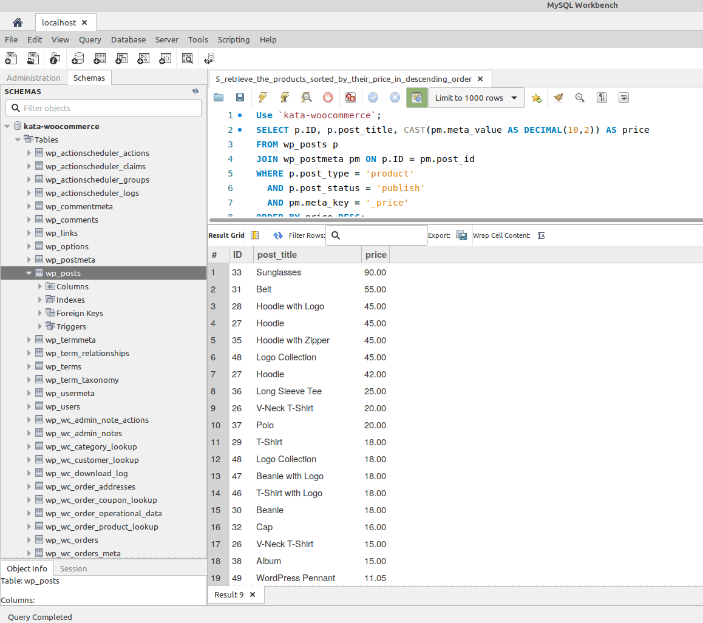
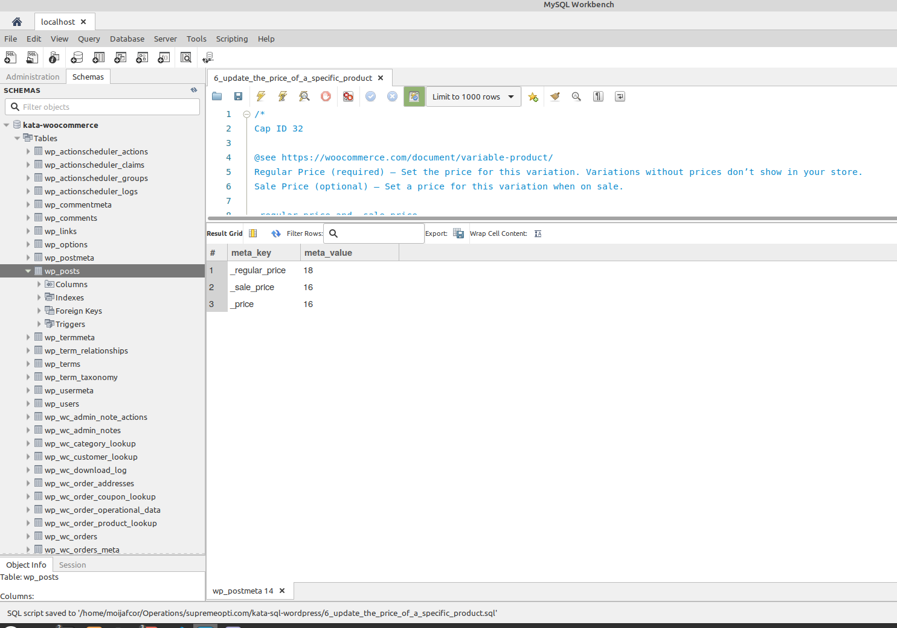
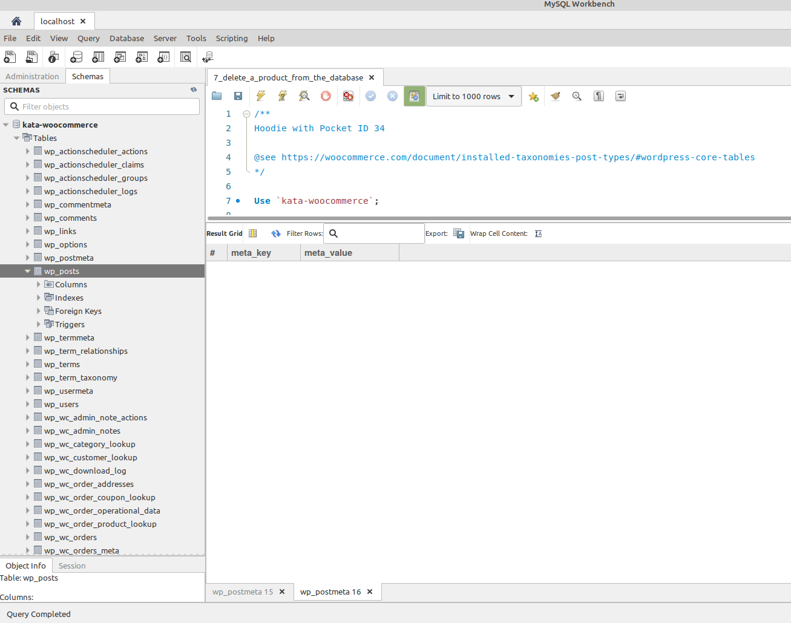
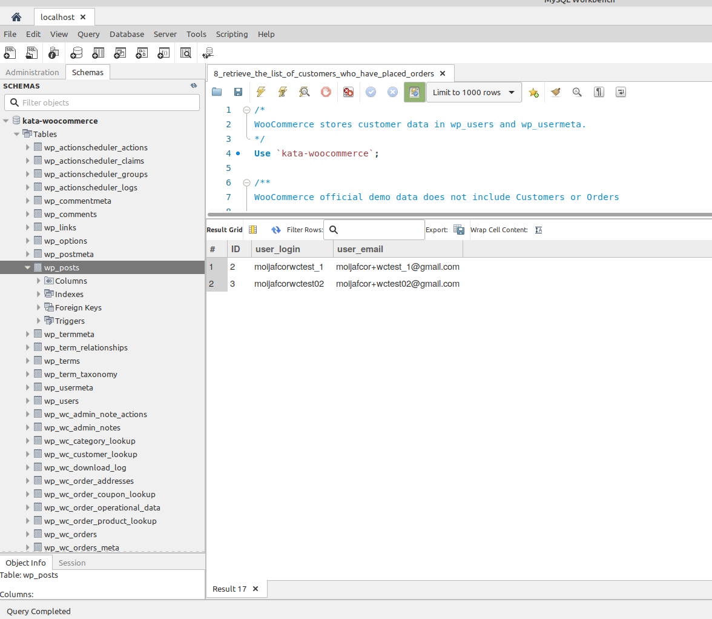
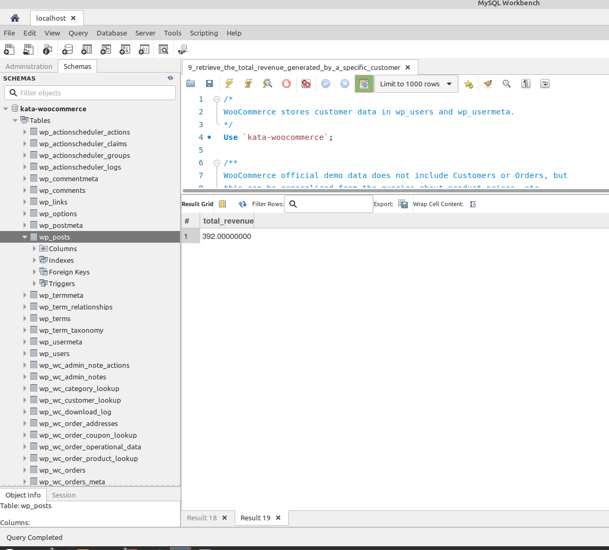
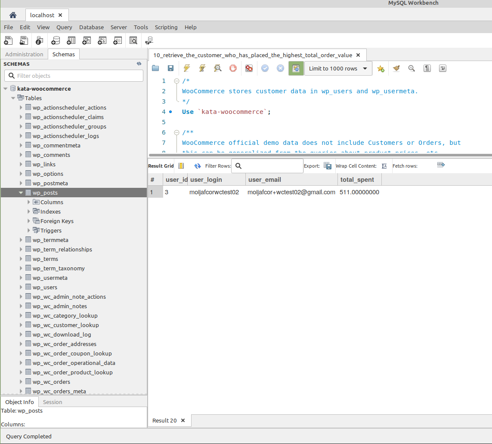

# Code Katas

## SQL Wordpress + WooCommerce

Using WordPress with WooCommerce installed and Demo data complete the following using just MySQL. 

Write and execute SQL queries to perform the following operations:

1. Retrieve a list of all products.
2. Retrieve the details of a specific product by its ID.
3. Retrieve the total number of products.
4. Retrieve the average price of all products.
5. Retrieve the products sorted by their price in descending order.
6. Update the price of a specific product.
7. Delete a product from the database.
8. Retrieve the list of customers who have placed orders.
9. Retrieve the total revenue generated by a specific customer.
10. Retrieve the customer who has placed the highest total order value.

### Queries & Result Sets

#### 1 Retrieve a list of all products.

```sql
/*
WooCommerce stores products as a custom post type (product) 
and uses postmeta for metadata (like price).
*/
Use `kata-woocommerce`;
SELECT ID, post_title, post_date
FROM wp_posts
WHERE post_type = 'product'
  AND post_status = 'publish';
```



#### 2 Retrieve the details of a specific product by its ID.

```sql
/**
Hoodie with Pocket ID 34
*/
Use `kata-woocommerce`;
SELECT p.ID, p.post_title, p.post_content, pm.meta_key, pm.meta_value
FROM wp_posts p
LEFT JOIN wp_postmeta pm ON p.ID = pm.post_id
WHERE p.ID = 26;
```



#### 3 Retrieve the total number of products.

```sql
Use `kata-woocommerce`;

SELECT COUNT(*) AS total_products
FROM wp_posts
WHERE post_type = 'product'
  AND post_status = 'publish';
  
/**
SELECT COUNT(*) AS total_products
FROM wp_posts
WHERE post_type = 'product';
*/
```



#### 4 Retrieve the average price of all products.

```sql
Use `kata-woocommerce`;
SELECT AVG(CAST(pm.meta_value AS DECIMAL(10,2))) AS avg_price
FROM wp_postmeta pm
JOIN wp_posts p ON pm.post_id = p.ID
WHERE pm.meta_key = '_price'
  AND p.post_type = 'product'
  AND p.post_status = 'publish';

/** '29.335714' */
```



#### 5 Retrieve the products sorted by their price in descending order.

```sql
Use `kata-woocommerce`;
SELECT p.ID, p.post_title, CAST(pm.meta_value AS DECIMAL(10,2)) AS price
FROM wp_posts p
JOIN wp_postmeta pm ON p.ID = pm.post_id
WHERE p.post_type = 'product'
  AND p.post_status = 'publish'
  AND pm.meta_key = '_price'
ORDER BY price DESC;
```



#### 6 Update the price of a specific product

```sql
/*
Cap ID 32

@see https://woocommerce.com/document/variable-product/
Regular Price (required) – Set the price for this variation. Variations without prices don’t show in your store.
Sale Price (optional) – Set a price for this variation when on sale.

_regular_price and _sale_price
*/

Use `kata-woocommerce`;

SELECT meta_key, meta_value
FROM wp_postmeta
WHERE post_id = 32
  AND meta_key IN ('_price', '_regular_price', '_sale_price');

/** Use `kata-woocommerce`; 
Let's mark up each price by 100
 */
 
UPDATE wp_postmeta
SET meta_value = '118'
WHERE post_id = 32 AND meta_key = '_price';

UPDATE wp_postmeta
SET meta_value = '116'
WHERE post_id = 32 AND meta_key = '_regular_price';

UPDATE wp_postmeta
SET meta_value = '116'
WHERE post_id = 32 AND meta_key = '_sale_price';

/** Verify */

SELECT meta_key, meta_value
FROM wp_postmeta
WHERE post_id = 32
  AND meta_key IN ('_price', '_regular_price', '_sale_price')
```



#### 7 Delete a product from the database.
```sql
/**
Hoodie with Pocket ID 34

@see https://woocommerce.com/document/installed-taxonomies-post-types/#wordpress-core-tables
*/

Use `kata-woocommerce`;

/** Does product exist? */
SELECT meta_key, meta_value
FROM wp_postmeta
WHERE post_id = 34
  AND meta_key IN ('_price', '_regular_price', '_sale_price');
  
DELETE FROM wp_postmeta WHERE post_id = 34;
DELETE FROM wp_term_relationships WHERE object_id = 34;
DELETE FROM wp_posts WHERE ID = 34;


/** Verify */

SELECT meta_key, meta_value
FROM wp_postmeta
WHERE post_id = 34
  AND meta_key IN ('_price', '_regular_price', '_sale_price');
```



#### 8 Retrieve the list of customers who have placed orders.
```sql
/*
WooCommerce stores customer data in wp_users and wp_usermeta.
*/
Use `kata-woocommerce`;

/**
WooCommerce official demo data does not include Customers or Orders.
Data created manually.

@see https://github.com/woocommerce/woocommerce/blob/trunk/plugins/woocommerce/sample-data/sample_products.csv
*/
SELECT DISTINCT u.ID, u.user_login, u.user_email
FROM wp_users u
JOIN wp_wc_orders o ON u.ID = o.customer_id
WHERE o.status IN ('wc-completed', 'wc-processing');
```



#### 9 Retrieve the total revenue generated by a specific customer.
```sql
/*
WooCommerce stores customer data in wp_users and wp_usermeta.
*/
Use `kata-woocommerce`;

/**
WooCommerce official demo data does not include Customers or Orders.
Uses created manually.

@see https://github.com/woocommerce/woocommerce/blob/trunk/plugins/woocommerce/sample-data/sample_products.csv

@see https://woocommerce.com/document/installed-taxonomies-post-types/#wordpress-core-tables
*/
/**
Customer ID 2
*/
SELECT 
    SUM(total_amount) AS total_revenue
FROM wp_wc_orders
WHERE customer_id = 2
  AND status IN ('wc-completed', 'wc-processing');
  
/**
Customer Email: 
*/
SELECT 
    SUM(o.total_amount) AS total_revenue
FROM wp_wc_orders o
JOIN wp_wc_order_addresses oa 
    ON oa.order_id = o.id AND oa.address_type = 'billing'
WHERE oa.email = 'moijafcor+wctest_1@gmail.com'
  AND o.status IN ('wc-completed', 'wc-processing');
```



#### 10 Retrieve the customer who has placed the highest total order value.
```sql
/*
WooCommerce stores customer data in wp_users and wp_usermeta.
*/
Use `kata-woocommerce`;

/**
WooCommerce official demo data does not include Customers or Orders.
Uses created manually.

@see https://github.com/woocommerce/woocommerce/blob/trunk/plugins/woocommerce/sample-data/sample_products.csv

@see https://woocommerce.com/document/installed-taxonomies-post-types/#wordpress-core-tables
*/
SELECT 
    u.ID AS user_id,
    u.user_login,
    u.user_email,
    SUM(o.total_amount) AS total_spent
FROM wp_wc_orders o
JOIN wp_users u ON u.ID = o.customer_id
WHERE o.status IN ('wc-completed', 'wc-processing')
GROUP BY u.ID
ORDER BY total_spent DESC
LIMIT 1;

```


### Database export from test install

```bash
kata-woocommerce.sql
```
